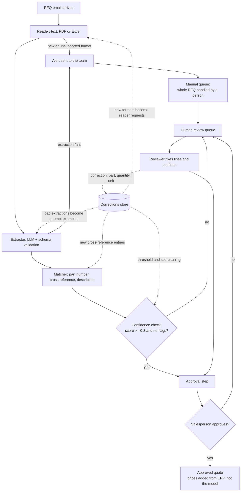

# RFQ email flow (draft)

```mermaid
flowchart TD
    IN[RFQ email arrives] --> R[Reader: text, PDF or Excel]
    R -->|new or unsupported format| ALERT
    R --> X[Extractor: LLM + schema validation]
    X -->|extraction fails| ALERT
    X --> M[Matcher: part number, cross reference, description]
    M --> C{Confidence check:<br/>score >= 0.8 and no flags?}
    C -->|yes| AP[Approval step]
    C -->|no| Q[Human review queue]

    ALERT[Alert sent to the team] --> MQ[Manual queue:<br/>whole RFQ handled by a person]
    MQ --> Q

    Q --> RV[Reviewer fixes lines and confirms]
    RV --> AP
    AP --> OK{Salesperson approves?}
    OK -->|yes| DONE[Approved quote<br/>prices added from ERP, not the model]
    OK -->|no| Q

    RV -.->|correction: part, quantity, unit| FB[(Corrections store)]
    FB -.->|new cross-reference entries| M
    FB -.->|bad extractions become prompt examples| X
    FB -.->|new formats become reader requests| R
    FB -.->|threshold and score tuning| C
```

Solid lines are the normal path and the two failure paths. Dotted lines are the reviewer feedback loop.
